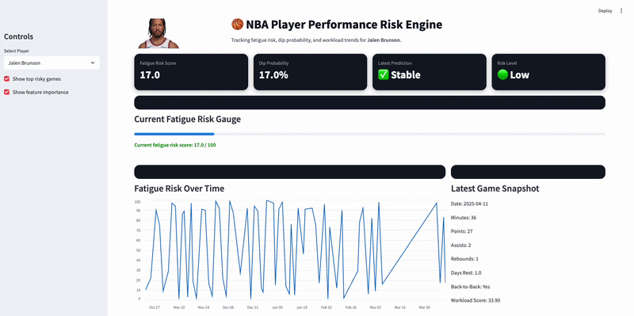

# NBA Player Fatigue + Availability Risk Engine

A production-style sports analytics and machine learning project that predicts short-term performance dips and fatigue-related risk in NBA players using workload, schedule density, and recent performance trends.

## Live Application

👉 Interactive dashboard built with Streamlit - 

- Select any player
- View fatigue risk + dip probability
- Explore workload trends over time
- Identify high-risk games

## 🎥 App Demo



## Why I built this

As a former professional basketball player, I wanted to quantify something players feel in real life: fatigue is cumulative, travel matters, schedule density matters, and not all minutes cost the same.

This project turns that lived experience into a data product + predictive system:
- a fatigue risk engine
- a performance dip prediction model
- a reusable player-level prediction pipeline

The goal is to show how basketball knowledge, data science, and machine learning engineering can come together in one real-world project.

## What This Project Does

This system combines:

1. **NBA Fatigue Risk Engine**  
   Estimate player fatigue based on minutes load, rest days, back-to-backs and rolling workload.

2. **Performance Dip Prediction Model**  
   Predict whether a player will underperform next game.

3. **End-to-End Data Pipeline**  
   Fully reproducible workflow:
   ingest → clean → feature engineer → train → predict → visualize

## Key Insights

- Scoring output (PTS) is the strongest predictor of dips
- Workload score significantly impacts fatigue risk
- Rolling performance trends are critical signals
- Fatigue is multi-factor, not just minutes played

## Model Insight

Fatigue is driven by a combination of:

- Short rest periods
- Back-to-back games
- Accumulated workload
- Recent performance trends

## Feature Importance


## Modeling Objectives

This project focuses on two modeling tasks:

### 1) Classification
Predict whether a player will experience a **next-game performance dip**.

Example definitions may include:
- points below rolling average
- FG% / TS% below baseline
- Game Score below expected level
- meaningful drop in all-around production

### 2) Risk Scoring
Estimate a continuous **fatigue or availability risk score** (0-100) based on:
- recent minutes
- days of rest
- back-to-back flags
- 3 games in 4 nights / 4 games in 6 nights (workload)
- travel burden
- age and experience curves

## Model Performance

- Accuracy: 0.87
- Balanced precision/recall
- Strong early signal with limited dataset

## Key Features Engineered 

- days_rest
- is_back_to_back
- rolling_pts_3
- rolling_min_3
- rolling_ast_3
- rolling_reb_3
- workload_score

## Tech stack

- **Python**
- **pandas**
- **numpy**
- **scikit-learn**
- **SQL**
- **Matplotlib**
- **Streamlit**
- **Git + GitHub**

## Data sources

Planned data sources include:
- NBA game logs
- Basketball-Reference game logs and player pages
- Publicly available schedule data
- Public injury / availability reports where appropriate

## Pipeline Overview 

Data Collection → Cleaning → Feature Engineering → Labeling
→ Model Training → Evaluation → Predictions → Visualization

## Streamlit Application
This project includes a fully interactive dashboard:

Features:
Player selection dropdown
Fatigue Risk Score (0–100)
Dip Probability (%)
Risk classification (Low / Medium / High)
Fatigue trend visualization
Recent game snapshot
Top risky games detection

## Planned workflow

1. Collect player game log data
2. Clean and standardize raw data
3. Create workload and schedule-density features
4. Define performance dip labels
5. Train baseline classification models
6. Improve with better feature engineering
7. Evaluate model performance
8. Visualize fatigue-risk patterns
9. Build a small Streamlit app for interactive exploration

## Business/Basketball Impact

This type of system can be used by:

NBA teams → player load management
Sports betting platforms → performance forecasting
Fantasy sports → player projections
Media → storytelling + analytics

## Repository structure

```text
nba-fatigue-availability-risk-engine/
│
├── README.md
├── requirements.txt
├── .gitignore
├── LICENSE
│
├── data/
│   ├── raw/
│   ├── interim/
│   └── processed/
│
├── notebooks/
│   ├── 01_data_collection.ipynb
│   ├── 02_eda.ipynb
│   ├── 03_feature_engineering.ipynb
│   ├── 04_modeling.ipynb
│   └── 05_error_analysis.ipynb
│
├── src/
│   ├── data_collection.py
│   ├── preprocessing.py
│   ├── feature_engineering.py
│   ├── labeling.py
│   ├── train.py
│   ├── evaluate.py
│   └── predict.py
│
├── sql/
├── models/
├── reports/
├── app/
└── tests/
