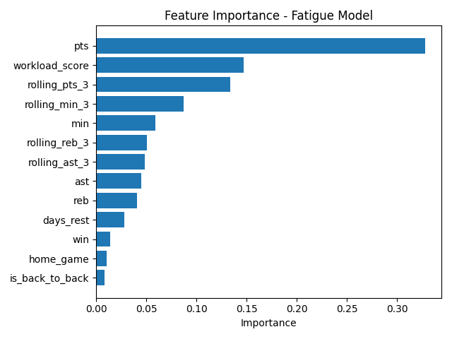

# NBA Player Fatigue + Availability Risk Engine

A sports analytics and machine learning project that predicts short-term performance dips and workload-related availability risk in NBA players using game logs, schedule density, travel burden, rest patterns, and rolling performance baselines.

## Why I built this

As a former professional basketball player, I wanted to quantify something players feel in real life: fatigue is cumulative, travel matters, compressed schedules matter, and not all minutes cost the same.

This project turns that lived experience into a data product:
- a fatigue risk engine
- a performance dip prediction model
- a reusable player-level prediction pipeline

The goal is to show how basketball knowledge, data science, and machine learning engineering can come together in one real-world project.

## Project goals

This project combines three ideas into one:

1. **NBA Fatigue Risk Engine**  
   Estimate how schedule density, minutes load, and travel stress affect player performance.

2. **Performance Degradation Under Schedule Density**  
   Predict whether a player is likely to experience a next-game performance dip.

3. **Player Fatigue Prediction Pipeline**  
   Build a reusable end-to-end pipeline for ingesting NBA data, engineering workload features, training models, and generating predictions.

## Project objective

The goal of this project is to identify whether a player is at risk of a performance dip based on:

- recent scoring trend
- recent minutes load
- days of rest
- back-to-back schedule pressure
- a custom workload score

## Core questions

- Does playing in back-to-backs increase next-game performance decline?
- How much do rolling minutes and recent workload affect efficiency?
- Does travel burden raise fatigue-related risk?
- Can we predict short-term performance drops from schedule and workload context?
- Which player profiles appear most vulnerable to schedule compression?

## 📊 Key Insights

- Player scoring output (`PTS`) is the strongest predictor of performance dips
- Custom workload score significantly impacts fatigue modeling
- Recent performance trends (rolling averages) are critical indicators

## 🧠 Model Insight

The model shows that fatigue is not just about minutes played, but a combination of:

- Short rest periods
- Back-to-back games
- Accumulated workload
- Recent performance trends

## 📈 Feature Importance



## Target outcomes

This project focuses on two modeling tasks:

### 1) Classification
Predict whether a player will experience a **next-game performance dip**.

Example definitions may include:
- points below rolling average
- FG% / TS% below baseline
- Game Score below expected level
- meaningful drop in all-around production

### 2) Risk scoring / regression
Estimate a continuous **fatigue or availability risk score** based on:
- recent minutes
- days of rest
- back-to-back flags
- 3 games in 4 nights / 4 games in 6 nights
- travel burden
- age and experience curves

## Tech stack

- **Python**
- **pandas**
- **numpy**
- **scikit-learn**
- **SQL**
- **Matplotlib / Plotly**
- **Streamlit**
- **Git + GitHub**

## Data sources

Planned data sources include:
- NBA game logs
- Basketball-Reference game logs and player pages
- Publicly available schedule data
- Public injury / availability reports where appropriate

## Feature ideas

Examples of planned features:

### Schedule load
- back-to-back indicator
- games in last 3 days
- games in last 5 days
- 3-in-4 nights
- 4-in-6 nights
- days of rest

### Workload
- minutes last game
- rolling average minutes
- rolling points
- rolling assists
- rolling rebounds
- rolling shooting efficiency
- rolling Game Score

### Travel and context
- home vs away
- road trip length
- travel distance between games
- opponent strength proxy

### Player profile
- age
- years in league
- position group
- season-to-date workload

## Planned workflow

1. Collect player game log data
2. Clean and standardize raw data
3. Create workload and schedule-density features
4. Define performance dip labels
5. Train baseline classification models
6. Improve with better feature engineering
7. Evaluate model performance
8. Visualize fatigue-risk patterns
9. Build a small Streamlit app for interactive exploration

## Pipeline overview

1. Pull real NBA player game logs
2. Clean and standardize columns
3. Engineer fatigue-related features
4. Create a performance dip target
5. Train a Random Forest model
6. Evaluate predictions
7. Visualize feature importance

## Key engineered features

- `days_rest`
- `is_back_to_back`
- `rolling_pts_3`
- `rolling_min_3`
- `rolling_ast_3`
- `rolling_reb_3`
- `workload_score`

## Model results

Current model performance on the real multi-player dataset:

- Accuracy: **0.87**
- Balanced precision / recall across both classes
- Strong early signal despite a relatively small sample

## Top insights

The most important features in the current model were:

1. `pts`
2. `workload_score`
3. `rolling_pts_3`

This suggests that:
- recent scoring level matters
- cumulative workload matters
- short-term form matters

## Repository structure

```text
nba-fatigue-availability-risk-engine/
│
├── README.md
├── requirements.txt
├── .gitignore
├── LICENSE
│
├── data/
│   ├── raw/
│   ├── interim/
│   └── processed/
│
├── notebooks/
│   ├── 01_data_collection.ipynb
│   ├── 02_eda.ipynb
│   ├── 03_feature_engineering.ipynb
│   ├── 04_modeling.ipynb
│   └── 05_error_analysis.ipynb
│
├── src/
│   ├── data_collection.py
│   ├── preprocessing.py
│   ├── feature_engineering.py
│   ├── labeling.py
│   ├── train.py
│   ├── evaluate.py
│   └── predict.py
│
├── sql/
├── models/
├── reports/
├── app/
└── tests/
